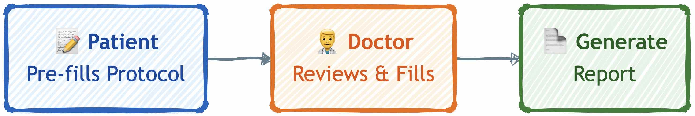
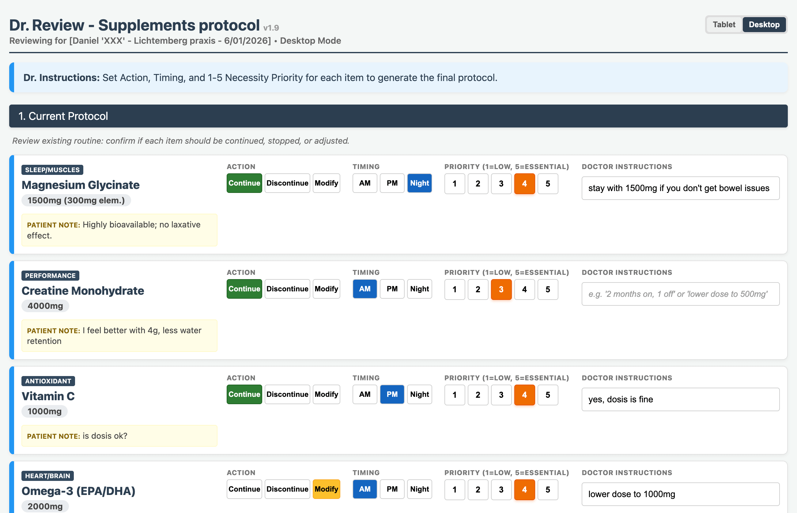
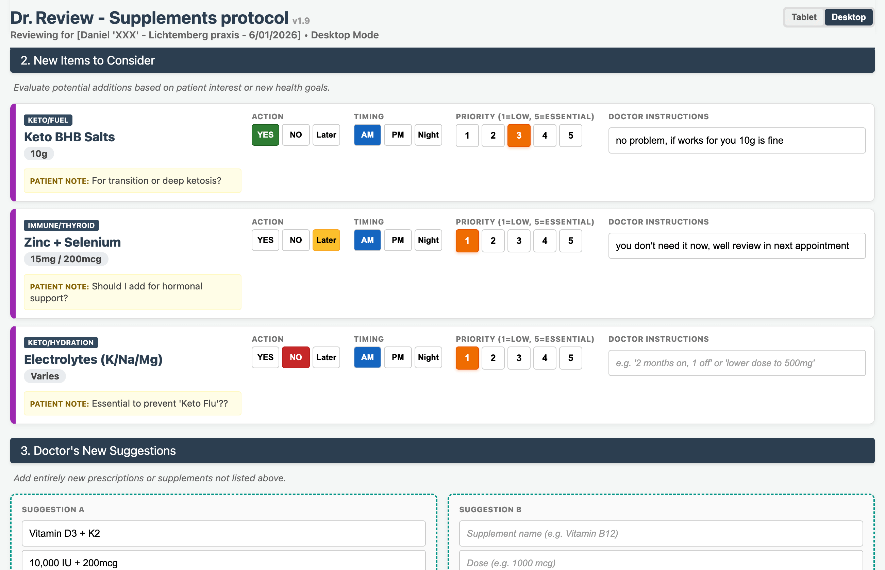
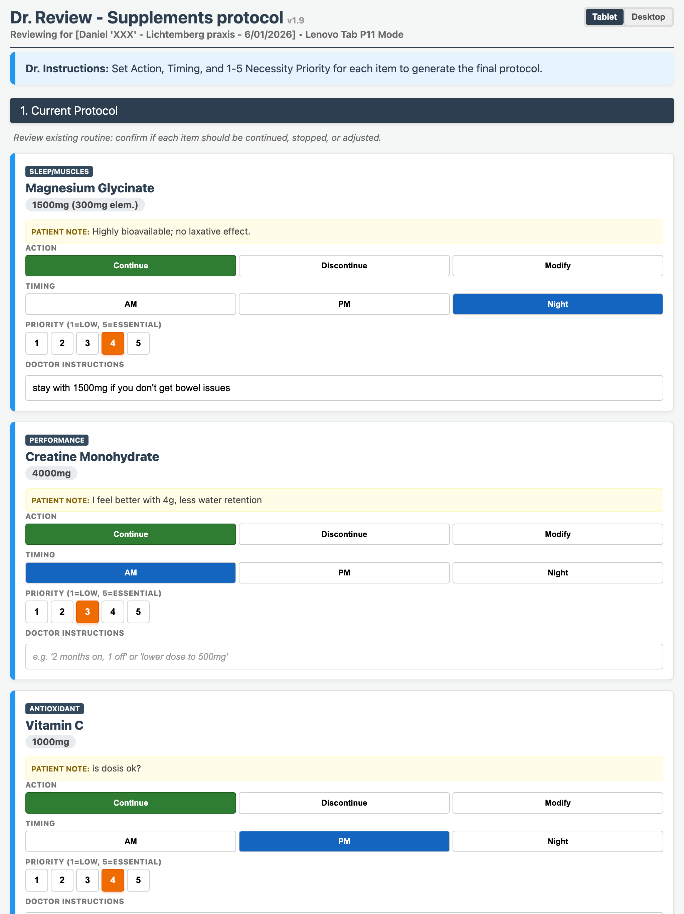
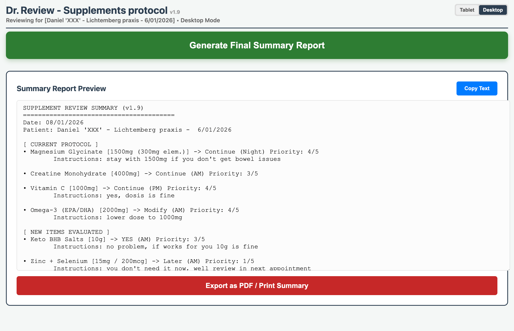

# Doctor Visit Supplements Review Tool

A single-file, offline HTML tool designed to optimize 5-10 minute doctor appointments. Hand your tablet to your doctor, review your supplement protocol, get "Green Light / Red Light" decisions, and generate a summary report—all without an internet connection.

### Workflow


## 📑 Table of Contents

- [🎯 What This Is](#-what-this-is)
- [📸 Screenshots](#-screenshots)
- [📖 The Story](#-the-story)
- [🚀 Quick Start](#-quick-start)
- [📝 Editing Your Data](#-editing-your-data)
  - [Data Structure](#data-structure)
- [💻 How It Works](#-how-it-works)
- [🔒 Privacy & Security](#-privacy--security)
- [📄 License](#-license)
- [🛠️ Technical Details](#-technical-details)
- [🤝 Contributing](#-contributing)
- [⚠️ Disclaimer](#️-disclaimer)

## 🎯 What This Is

This is a **local-first**, **zero-dependency** web application that runs entirely in your browser. No servers, no databases, no tracking. The report data -doctor's answers- exists only in RAM and disappears when you refresh the page. Your input data -supplements protocol, notes and questions for your doctor- lives on your version of the edited HTML file.
Built as a "quick hack" to solve a personal pain point—efficiency in GP appointment slots.

**Author's Note:**  This is a simple tool that just works, built by someone who got tired of wasting precious appointment time explaining supplement stacks. If it helps you too, great. If not, fork it and make it better.

## 📸 Screenshots

<details>
<summary>Click to view screenshots of the application</summary>

### Desktop Mode

**Current Protocol Section**

*Doctor reviewing current supplements with Action, Timing, and Priority controls*

**New Items & Doctor Suggestions**

*Evaluating new supplements and adding doctor's own recommendations*

### Tablet Mode

**Overview**

*Responsive layout optimized for tablet screens*

### Generated Report

**Summary Report**

*Final summary report ready for export or printing*

</details>

## 📖 The Story

I need to get feedback from my doctor on my "Supplements Protocol" so I can fix it if I'm doing something terribly wrong—or stop wasting money on the ones that don't help.

**My problem:** My experience with GPs (Hausarzt) in Germany has been… "efficient", let's say. 10-minute appointment windows, 1 or 2 questions, and then "take a chamomile tea and ibuprofen, next one!"

I'm not a biohacker wannabe. I don't need "super-duper specialized DNA lab tests" and I don't want to wait 3 months to see a specialist. I'm just a simple human trying to take small steps to improve my overall health.

I just want him to check my bloodwork and give me a "Green / Red Light" on my list items without wasting 90% of the appointment verbally listing supplements back and forth, only to get feedback on 2 or 3.

**The Solution:** I managed to build a usable app in a few hours with Gemini, despite my frontend skills being… let's be generous and call them "very basic." (I'm a hardware/embedded guy; if code doesn't touch a microcontroller or the Linux Kernel, I'm usually lost).

But the hard part wasn't the code. It was the "Big Picture." It's too easy to get lost in the tech stack and forget the actual problem: I just want to optimize my 10-minute slot with my GP so I can actually get something useful out of it.

So I bullied Gemini until we had this: A local, offline, "quick and dirty" HTML file. No server. No cloud. No GSM signal needed in the doctor's bunker (office). Just big buttons and medical terms so he doesn't have to think much, just tap.

I spent a few years designing hardware for an innovative non-invasive glucose monitoring device. Solving the technical challenges was super fun! but then, I saw the face of Medical Device Regulations. For "Class II" devices, you need industry-specific Quality Management Systems, certified Technical Documentation… essential for safety, but a bureaucratic nightmare for an engineer who likes to move fast. The fun ends very soon. 😅

So, because I want to avoid over-filling my "forgotten side-projects bucket," I'm sharing the project here. It might save you a few hours of prompt-engineering and trying to figure out how doctors operate.


## 🚀 Quick Start

1. **Download** `supplements_review.html` (latest version from GitHub: [direct download link](https://raw.githubusercontent.com/damancusonqn/doc-supplements-protocol-review/main/supplements_review.html))
2. **Open** it in any text editor (Notepad, VS Code, TextEdit, etc.)
3. **Scroll** to the `// --- USER DATA SECTION (EDIT THIS) ---` comment block
4. **Edit** your supplements list in the `MY_DATA` object
5. **Save** the file
6. **Open** it in any modern web browser (Chrome, Firefox, Safari, Edge)

That's it. No installation, no npm, no build process. Just edit and open.

## 📝 Editing Your Data

The file is structured with clear markers. **ONLY EDIT** the section marked:

```javascript
// ============================================
// --- USER DATA SECTION (EDIT THIS) ---
// ============================================
// Everything below this line is YOUR data.
// Everything above is the app logic - DO NOT EDIT.
// ============================================

const MY_DATA = {
    version: "1.9",
    patientName: "Your Name Here",
    viewMode: "desktop",  // or "tablet"
    current: [
        // Your current supplements go here
    ],
    considered: [
        // Supplements you're considering go here
    ]
};

// ============================================
// --- END OF USER DATA SECTION ---
// ============================================
// DO NOT EDIT BELOW THIS LINE
// ============================================
```

### Data Structure

Each supplement entry should follow this format:

```javascript
{
    id: 'c1',                    // Unique ID (e.g., 'c1', 'c2', 'q1')
    name: "Vitamin D3 + K2-MK7", // Supplement name
    dose: "10,000 IU + 200mcg",  // Dosage
    category: "Bone/Immune",      // Category tag
    note: "Dose too high?",       // Your note/question for the doctor
    status: null,                 // Leave as null - doctor will set this during review
    time: 'AM'                    // Timing: 'AM', 'PM', or 'Night'
}
```

**Fields:**
- `id`: Must be unique. Use 'c1', 'c2', etc. for current supplements, 'q1', 'q2', etc. for considered items.
- `name`: The supplement name
- `dose`: Dosage information
- `category`: Optional category tag (e.g., "Performance", "Sleep/Collagen", "Heart/Brain")
- `note`: Your question or note for the doctor
- `status`: **Always set to `null`** - the doctor will set this during the review (Continue/Modify/Discontinue for current items, YES/NO/Later for considered items)
- `time`: `'AM'`, `'PM'`, or `'Night'`

## 💻 How It Works

1. **Tablet Mode / Desktop Mode**: Toggle between optimized layouts for different screen sizes
2. **Review Interface**: Doctor sets Action (Continue/Discontinue/Modify), Timing, and Priority (1-5) for each item, and can add any other suggestions they might have
3. **Generate Report**: Creates a formatted summary with all decisions
4. **Export**: Print to PDF or copy to clipboard
  
   ⚠️ **Important:** The doctor's inputs exist only in browser memory. **Refreshing the page or closing the tab will permanently lose all doctor's decisions.** Make sure to copy the report to clipboard or export to PDF before leaving the doctor's appointment!

## 🔒 Privacy & Security

- **100% Offline**: No network requests, no external resources
- **No Data Storage**: Data exists only in browser RAM -sandboxed-
- **No Tracking**: Zero analytics, zero telemetry
- **Local Only**: Open the file, use it, close it. That's it.

## 📄 License

MIT License - See the license header in `supplements_review.html` or the `LICENSE` file.

## 🛠️ Technical Details

- **Version**: 1.9
- **Dependencies**: None (zero external libraries)
- **Browser Support**: Any modern browser (Chrome, Firefox, Safari, Edge)
- **File Size**: ~10KB (single HTML file)
- **Architecture**: Monolithic HTML with embedded JavaScript and CSS

## 🤝 Contributing

Found a bug? Want to add a feature? Fork it, fix it, use it. This is open source in the truest sense—it's a tool that works, shared freely. If you make it better, share it back.

## ⚠️ Disclaimer

This tool is for informational purposes only. It does not provide medical advice. Always consult with a qualified healthcare professional before making changes to your supplement protocol.
